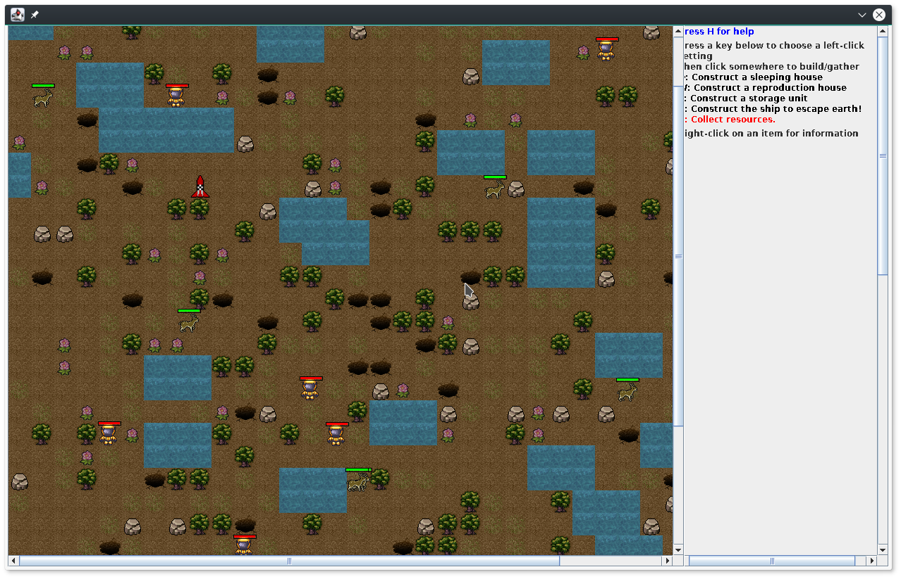

# CSC 335 Final: Settlement Management

Welcome to...

Escape from Earth!

You control a band of cosmonauts on Earth. There's only one problem:
a huge increase in seismic activity makes the planet unstable.
Frequent earthquakes threaten to destroy your colony.
Collect resources to survive and - if you can - build a ship to escape.

Contributors:
Artyom Perov, Tanner Bernth, Robert Walters, Caleb Short

